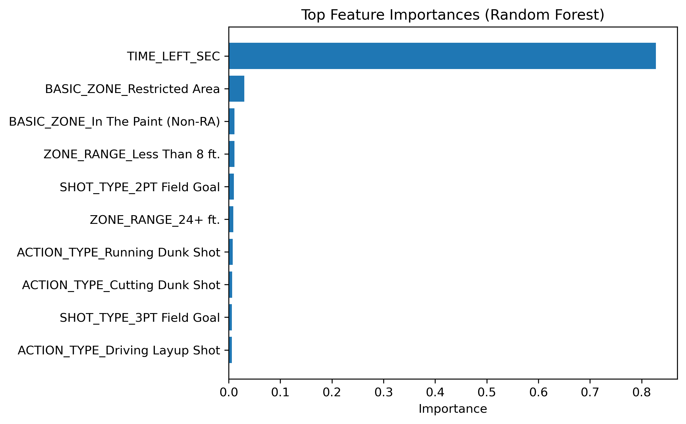
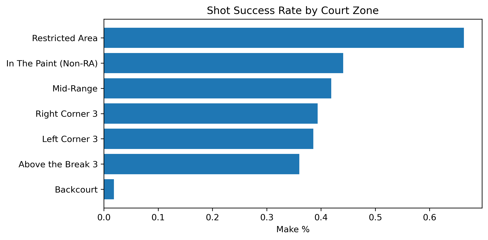

# NBA Shot Success Classification

This project uses NBA shot log data to predict whether a basketball shot will be successful based on contextual in-game features. It applies machine learning classification techniques to explore player efficiency and shot patterns.

---

## Project Objectives

- Predict shot success (make/miss) using game context features like location, game clock, and shot distance.
- Compare classification models and analyze feature importance.
- Visualize shooting patterns to uncover strategic insights.

---

## Dataset

- Source: [NBA Shots Dataset on Kaggle](https://www.kaggle.com/datasets/mexwell/nba-shots)
- This project uses shot data from the 2023–24 NBA season
- Contains over 80,000 shot attempts with detailed in-game context:
  - `LOC_X`, `LOC_Y`: Shot location on the court
  - `SHOT_DISTANCE`: Distance of the shot attempt
  - `MINS_LEFT`, `SECS_LEFT`: Time remaining in the quarter
  - `PERIOD`: Quarter of the game
  - `ACTION_TYPE`, `SHOT_TYPE`: Type of shot taken
  - `SHOT_MADE`: Target variable (1 = made, 0 = missed)

- Cleaned the data by removing irrelevant or high-cardinality columns (e.g. `PLAYER_NAME`, `TEAM_NAME`)
- Encoded categorical features using `OneHotEncoder`

---

## Tools & Technologies

- **Python**: pandas, numpy, matplotlib, seaborn
- **Modeling**: Logistic Regression, XGBoost (via scikit-learn & xgboost)
- **Evaluation**: Confusion Matrix, Precision, Recall, F1-score

---

## Key Visualizations

- **Feature Importance (XGBoost)**: Highlighted key contextual variables like time and location.
  

- **Shot Success by Court Zone**: Revealed high- and low-efficiency shot locations.
  

---

## Modeling Results

| Model              | Accuracy |
|--------------------|----------|
| Logistic Regression| 60%      |
| XGBoost            | 63%  |

- Most important features: `SECS_LEFT`, `LOC_X`, `LOC_Y`, `MINS_LEFT`
- Used GridSearchCV for XGBoost hyperparameter tuning
- Classification reports used to evaluate precision, recall, and F1-score

---

## Insights

- Final shot outcome is influenced by time left (`SECS_LEFT`, `MINS_LEFT`) and court location (`LOC_X`, `LOC_Y`)
- XGBoost performed best in classifying made vs. missed shots
- Feature importance analysis provided insight into which moments and positions affect shot success most

---

## Future Improvements

- Include player identities for personalized models
- Add more temporal context (e.g., game momentum, fatigue)
- Deploy with Streamlit for interactive exploration

---

## Setup Instructions

```bash
git clone https://github.com/TylerKT20/NBA-Shot-Classification.git
cd NBA-SHOT-CLASSIFICATION
pip install -r requirements.txt
```